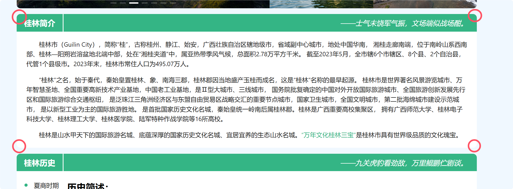
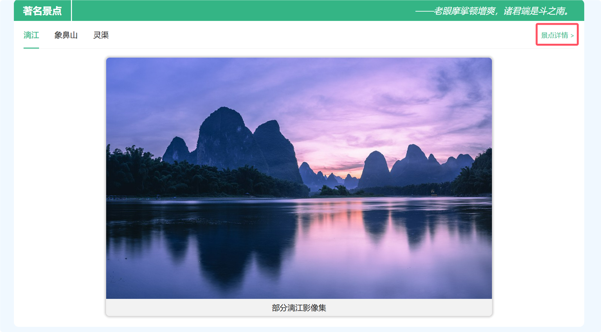
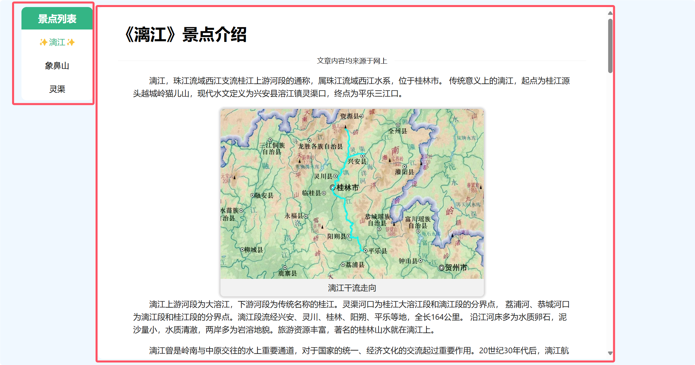
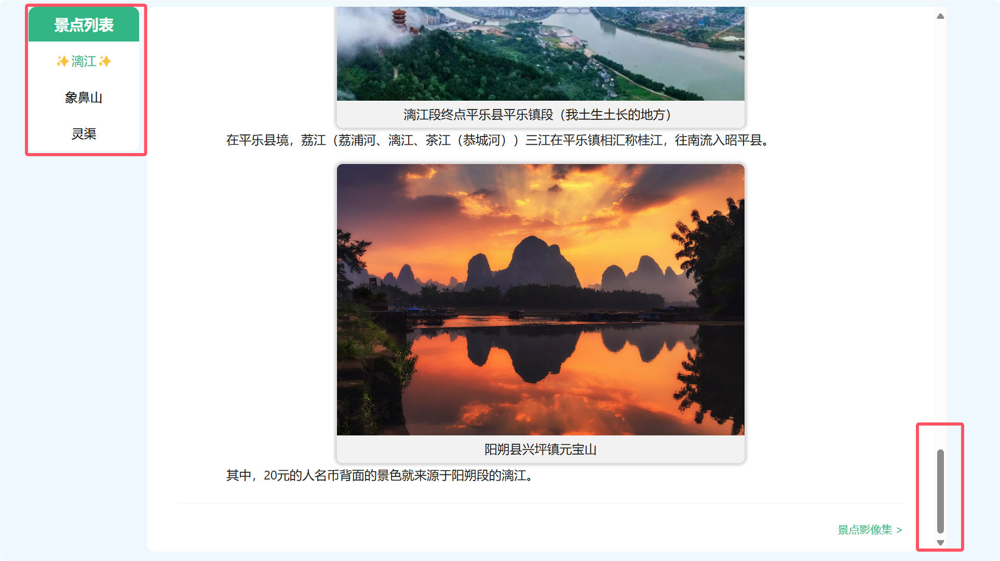
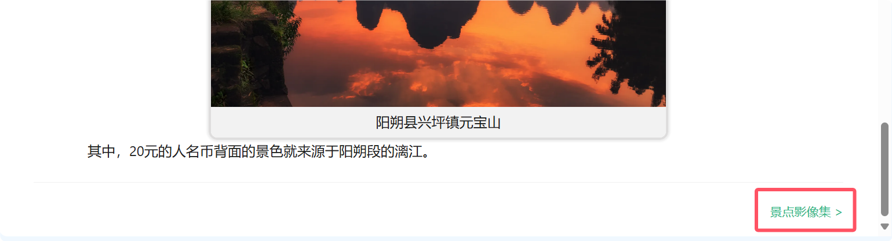
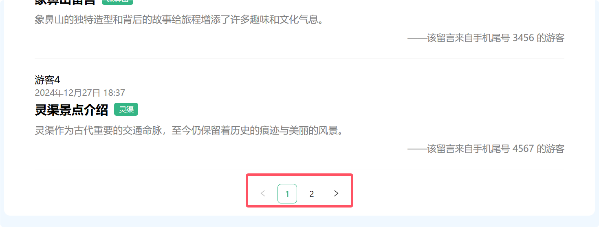
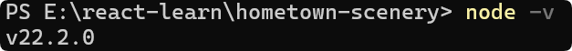

# 我的家乡景色

## 一、项目背景

这个项目是我大三上学期 Web 前端课程的一个结课作业。在作业的要求中提到可以使用一些技术框架来实现这个站点，而最近正好在学习 React 的相关内容，因此我决定借着这次作业的机会来巩固所学内容，并感受一下使用 React 来开发站点的完整流程。

我的家乡是桂林，因此整个网站都是在介绍桂林及其对应的景点。

*本项目仅仅只有前端，不包含后端。*

## 二、需求分析

### 前端需求分析

#### 首页

介绍桂林的历史、著名景点以及部分有关桂林的景点影像集。

#### 景点介绍页

漓江、象鼻山、灵渠。

#### 景点影像页

漓江、象鼻山、灵渠景点的影像集。

#### 留言收集页

收集游客对景点的留言信息。

## 三、技术说明

### 基于脚手架的前端工程化项目

前端工程化是指在前端开发过程中，通过工具、流程和规范的引入，提升开发效率、代码质量和项目可维护性的一系列实践。它涵盖了从代码编写到项目部署的整个生命周期。

工程化主要体现在下面的 3 个地方：

1. 工具化

   前端工程化通过使用构建工具（如 Webpack、Vite）、自动化工具（如 Gulp、Grunt）和包管理工具（如 npm、yarn）来简化和加速开发流程。

2. 流程化

   通过引入持续集成（CI）、持续部署（CD）等流程，确保代码在开发、测试和部署阶段的质量和一致性。

3. 规范化

   通过代码规范（ESLint）、版本控制（Git）和文档化（JSDoc）等手段，确保团队协作的高效和代码的可维护性。

综上可以看出前端工程化的主要优点是：提高开发效率、提升代码质量、增强团队协作、提高项目可维护等等。此外它还是现在企业里开发前端的必备工具之一。

### 基于 React 的组件化开发模式

组件指的是可复用、独立的 UI 元素，组件通常封装了特定功能或视图，可以在项目中被多次使用。组件化也是一种重要的开发模式，适当地封装和复用组件，有助于提高代码的可维护性、可扩展性和重用性。

其中在 React 中，每一个组件都是一个以大驼峰命名的 JavaScript 函数，并且这个函数需要返回一个类似 HTML 的字符串，这种字符串我们可以称为 JSX。

在传统的前端开发中，比如我想开发一个自定义样式的按钮，那么你可以先编写好 CSS 代码，然后让所有的 button 标签都加上对应的 CSS 类名或 ID。这种情况下如果是一个简单的组件，那完全没有什么问题，但是如果是稍微复杂一点的功能，比如说表单、布局、轮播图等等这些非常复杂的功能，直接引入 CSS 类名通常会显得很麻烦。

这时候我可能更希望不需要关注什么 CSS 类名这些东西，而是引入组件后直接在 HTML 中写上这个组件就可以直接生效了。

于是就有了像 React、Vue 这样的前端框架。在这些框架下，你只需要引入提前封装好组件，这些组件在框架的支持下通常可以直接编写在 HTML 中，并且组件内部通常已经写好对应的 CSS，所以你不需要刻意关注任何有关 CSS 的内容。这就是组件化开发模式。

在这种模式下，可以在很大程度上提高代码的复用性和可维护性。比如在这个项目中就手动封装了轮播图、相框等组件。

### 基于 Nextjs 的服务端渲染技术

在了解服务端渲染之前，可能还需要了解一下客户端渲染。

客户端渲染指的是浏览器需要等到所有的 JavaScript 下载完毕后，再由 JavaScript 来渲染整个页面，渲染的整个过程都是在浏览器上完成的。

服务端渲染指的是由服务器来完成 HTML 的页面拼接，然后直接将渲染好的 HTML 返回给浏览器。

通过概念可以大致地了解到：对于客户端渲染，用户第一时间看到的页面可能是一个未经渲染的原始页面；而对于服务端渲染来说，用户第一眼看到的页面就是完整的页面。

在这里有两个对比非常鲜明的框架：Vuejs、Nextjs。前者是典型的客户端渲染，后者是典型的服务端渲染。

对于本次作业对应的站点类型来说，基本上都是一些内容展示的页面，也就是说用户可能想第一时间看到页面的内容，而不是等待 JavaScript 来渲染页面。因此服务端渲染对于这种类型的网站来说是最合适的。

而支持服务端的框架很多，例如 Nextjs（React）、Nuxtjs（Vue）、SvelteKit（Svelte）。但是这个项目使用的脚手架是基于 React 的，因此选择了 Nextjs 作为最终的开发框架。

此外，服务端渲染对比客户端渲染还有许多的优势，比如：

1. 更好的 SEO 效果。
2. 对于弱网环境更加友好。
3. 有利于社交媒体的分享（预览信息完整）。

## 四、站点说明

整个网站的布局采用 Header、Content、Footer 的简单布局。


其中 Header 主要是导航栏、logo、slogan等等。Content 就是当前路由显示的内容。Footer 主要是网站的信息等等。

整个网站几乎 99% 的方框都采用圆角矩形，更加符合现代人的审美：



此外整个站点可以分为 4 个部分：

1. 首页
2. 景点介绍
3. 景点影像
4. 留言板

下面我来逐个介绍它们。

###  首页

这个页面可以分为 4 个部分：

1. **桂林印象**

   这部分主要是桂林一些景点的部分影像展示，主要是为了能让用户能快速地看到桂林的优美风景。

2. **桂林简介**

   这里主要是桂林的一些资料，相当于是对桂林简单的介绍。

3. **桂林历史**

   这部分从历史的维度更加详细的介绍了桂林的来源以及现状。

4. **著名景点**

   这部分主要是展示了 3 个桂林著名景点的部分影像。并在这部分引导用户前往站点的下一个部分。

   

### 景点介绍

这部分主要是对漓江、灵渠、象鼻山这 3 个景点的详细介绍。

这部分的页面包含左右两个子内容，其中左边是景点的名字，右边是该景点的详细介绍。



由于内容部分较多，因此肯定避免不了页面的滚动，但是一旦页面滚动到底部，正常情况下左边部分会随着滚动消失在浏览器的视口中。试想一下当前这个场景，当内容浏览完毕后，你是否会下意识的想前往下一个内容或页面呢？但是这时左边的切换栏却消失在了浏览器的视口中，于是你又要滚动鼠标回到页面顶部然后再点击下一个内容……

因此为了考虑到用户的体验，这里我将右边边框的高度设置一个固定值（这里设置的是 85% 的视口高度），然后使用 CSS 将多余的内容设置为滚动显示。

```css
.sceneryDescription {
  height: 85vh;
  overflow-x: hidden;  /* 隐藏 x 轴的滚动条 */
  overflow-y: auto;
}
```



这样即使右边内容滚动到底部，而左边的切换栏始终出现在浏览器的视口中。

此外，当内容浏览结束后，底部照样可以引导用户前往下一个页面：



### 景点影像

这个页面包含了指定景点的所有影像集。

### 留言板

留言板主要是游客在这个站点对某个景点的留言提交和这些留言的展示。

其中发表留言这个功能只是一个简简单单表单提交，既没有数据校验也没有集成后端。

留言收集主要收集用户名、手机号、留言的标题、留言的内容以及要留言的景点。

在真实情况下留言的数量可能很多，因此这里使用了一个分页展示。



## 五、运行项目

本项目使用 nodejs 来初始化并使用 npm 作为包管理工具。项目使用的 nodejs 版本是 v22.2.0，请确保你的 nodejs 版本大于等于它。



这里推荐使用 [nvm](https://github.com/nvm-sh/nvm) 来管理 nodejs 的版本。

1. 首先将代码仓库克隆到本地。

   ```bash
   git clone https://github.com/thcpdd/hometown-scenery.git
   ```

2. 进入 package.json 文件对应的目录中，并安装项目依赖。

   ```bash
   npm install
   ```

3. 以开发模式运行项目

   ```bash
   npm run dev
   ```

4. 最后访问 http://localhost:3000 即可预览项目。
